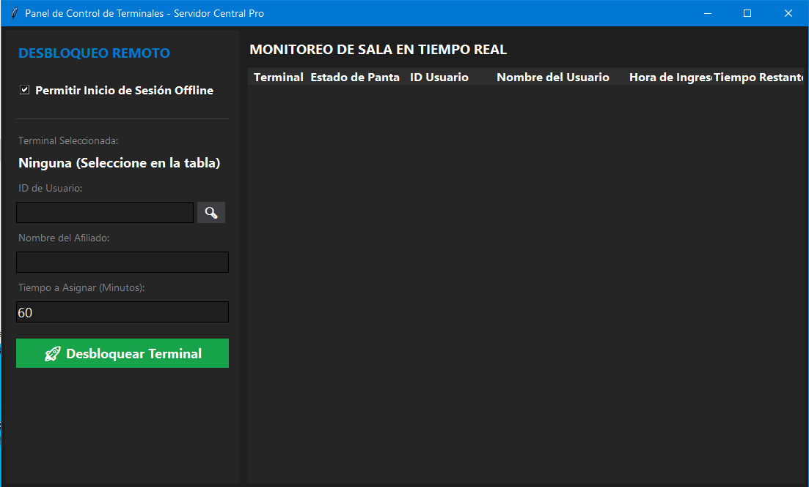
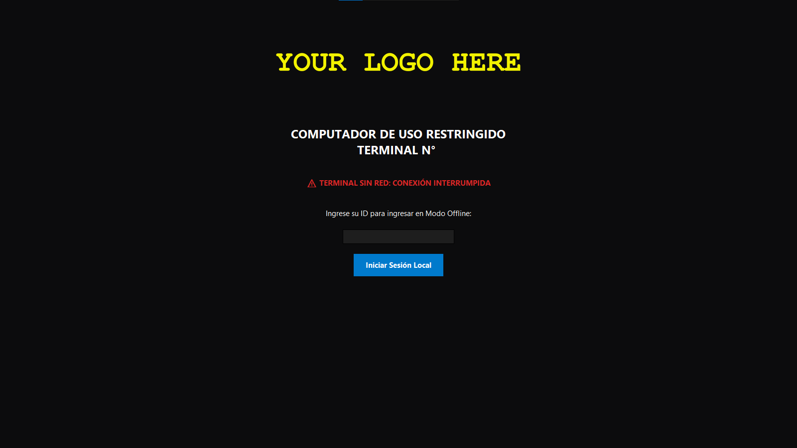

# Sistema de Control de Tiempos y Bloqueo de Terminales


Una solución sencilla de arquitectura Cliente-Servidor diseñada para gestionar sesiones de usuarios, realizar el seguimiento del tiempo de uso en terminales y ejecutar bloqueos remotos o automáticos del sistema. Ideal para entornos empresariales, laboratorios de cómputo compartidos o CyberCafé.

## 📸 Capturas de Pantalla

| Panel del Servidor (Monitoreo)                                            | Interfaz de Cliente (Terminal Bloqueada)                                     |
| ------------------------------------------------------------------------- | ---------------------------------------------------------------------------- |
|  |  |

---

## ✨ Características Principales

### 🖥️ Módulo Servidor

- **Monitoreo en Tiempo Real:** Visualización del estado de todos los terminales clientes conectados.
- **Gestión de Sesiones:** Control y asignación de tiempos de uso por usuario o terminal.
- **Persistencia de Datos:** Arquitectura respaldada por base de datos para auditorías e historiales de uso.

### 💻 Módulo Cliente

- **Bloqueo Seguro de Pantalla:** Interfaz de bloqueo persistente que impide el uso del sistema sin autorización.
- **Sincronización Fuera de Línea:** Capacidad de mantener el control del tiempo incluso ante desconexiones temporales de la red.
- **Ligero y Autónomo:** Diseñado para empaquetarse como ejecutable independiente.

---

## 🛠️ Arquitectura del Proyecto

El proyecto está dividido estrictamente en dos componentes independientes para facilitar su despliegue:

```text
├── client/          # Aplicación que se ejecuta en las terminales a controlar.
└── server/          # Panel central de administración y base de datos.
```

---

## 🚀 Instrucciones de Instalación y Despliegue

### Requisitos Previos

- Python 3.12 o superior instalado.
- Base de Datos Sqlite (Dependencias sqlite).

### 1. Configuración del Servidor

1. Navega a la carpeta del servidor e instala las dependencias necesarias:

```bash
cd server
pip install -r requirements.txt
```

2. Para probar el server en modo desarrollo, ejecuta:

```bash
python src/server.py
```

### 2. Configuración del Cliente

1. Navega a la carpeta del cliente e instala sus requerimientos:

```bash
cd ../client
pip install -r requirements.txt
```

2. Verifica la dirección IP del servidor en la consola del sistema:

```bash
cmd> ipconfig
```

3. Ingresa al archivo de configuración 'config_cliente.json' y configura la IP del servidor

4. Para probar el cliente en modo de desarrollo, ejecuta:

```bash
python src/cliente.py
```

---

## 📦 Compilación para Producción Server (Opcional)

Si deseas generar los archivos ejecutables (`.exe` o binarios nativos) para su sistema operativo sin necesidad de instalar Python en el servidor, puedes utilizar **PyInstaller**:

```bash
cd server
pyinstaller --noconfirm --onedir --noconsole --clean src/server.py
```

o también puedes generar el ejecutable usando server.spec

```bash
cd server
pyinstaller --clean src/server.spec
```

_Los binarios finales se generarán de manera automática en la carpeta `dist/`._

---

## 📦 Compilación para Producción Cliente (Opcional)

Si deseas generar los archivos ejecutables (`.exe` o binarios nativos) para su sistema operativo sin necesidad de instalar Python en los clientes, puedes utilizar **PyInstaller**:

```bash
cd client
pyinstaller --noconfirm --onedir --noconsole --clean src/cliente.py
```

o también puedes generar el ejecutable usando cliente.spec

```bash
cd client
pyinstaller --clean src/cliente.spec
```

_Los binarios finales se generarán de manera automática en la carpeta `dist/`._

---

## 🖼️ Para modificar el Logo que se muestra en el Cliente

Si deseas cambiar el logo que se muestra en el cliente, ve a la **carpeta de instalación del cliente**, luego ve a la carpeta **\_internal** y reemplaza **logo.png**

```bash
cd %programfiles%\Control Cliente\_internal\
```

---

## 📄 Licencia

Este proyecto está bajo la licencia **GNU GPLv3**. Esto significa que el software es de código abierto y cualquiera puede modificarlo o redistribuirlo, siempre y cuando las versiones modificadas mantengan la misma licencia de código abierto. Consulta el archivo [LICENSE](LICENSE) para más detalles.
